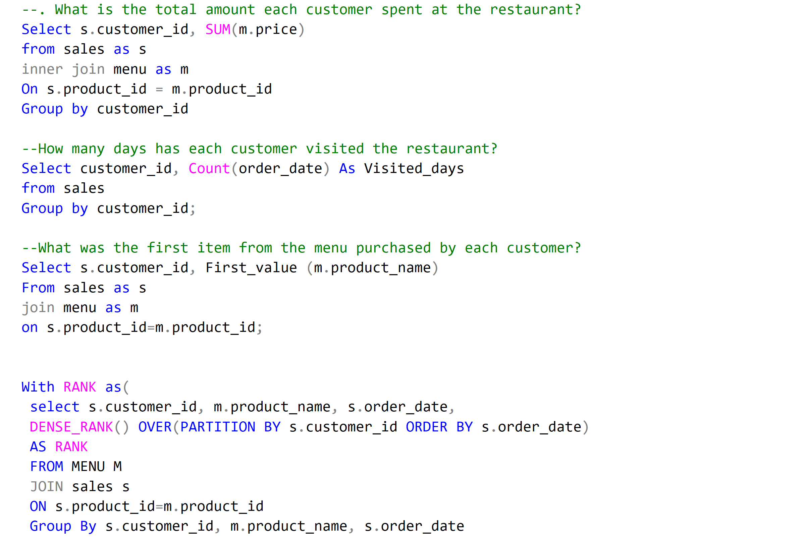
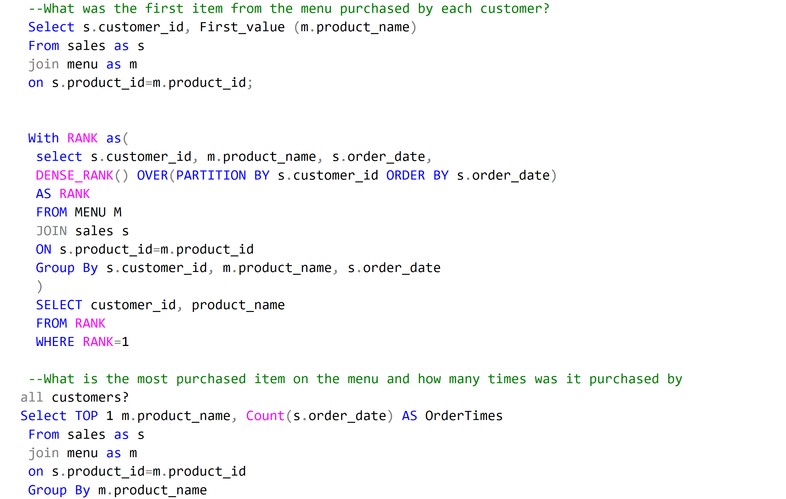

# Parcy & Pasey Business

--- 
## INTRODUCTION 

This is an SQL project on Business analysis and database use/management of an imaginary store called **Parcy & Pasey Business**.
The project is to analyze and derive insights to answer crucal business questionsand help the store make the dta driven decisions.
**_Disclaimer_** : _All datasets and reports do not represent any company, store, institution or country , but just a dummy dataset to demonstrate capabilities of Excel._

## Problem Statement: 

Problem Statement
1. Customers Patronage over-time
2. Customers most purchased item/favourite product
3. Business most busiest day and demands

## Skills/Concepts demonstrated:

The following SQL functions were used:

- Database creation,
- Tables creation in Databases,
- Data importation into Database,
- Sorting/arrangement of data,
- Querying database to get business data,
- Filtering of Data in tables with parameters, 
- 
  
We have 5 tables that shows day to day datas and transactions of customers purchases from the business database.

## Visualization:
SQL QUERIES            |         SQL QUERIES 
:-----------------------: | :--------------------:
        | 

## Analysis:

Above are some of the Queries used to answer and retrieve data from the tables in the database.

## Conclusion and Recommendations:
The data shows frequent item in stock purchased are food items, under home consumables category. 
It also shows the trend in weekly transactions which shows the busiest days.

